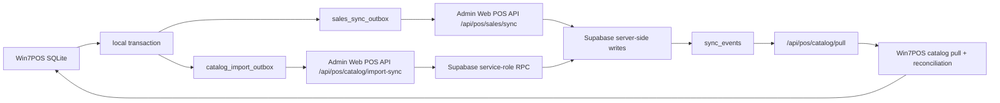

# POS / Admin Web / Supabase sync architecture

Status: code-aligned architecture note for branch `refactor/architecture-100-consolidation`.
Last updated: 2026-07-07.

## Logical flow



Win7POS never calls Supabase directly. The POS persists local business changes first, enqueues sync work in SQLite, and sends HTTPS requests only to Admin Web. Admin Web owns Supabase service-role access and redacts audit metadata.

## Local architecture map

```text
Win7POS.Wpf net48/x86
  -> UI services, dialogs, printer/spooler adapters, composition root
  -> Win7POS.Core netstandard2.0 domain rules/contracts
  -> Win7POS.Data netstandard2.0 adapters/repositories
  -> SQLite local DB and Admin Web POS API
```

Layer rules enforced by `scripts/check-architecture-boundaries.ps1`:

- Project shape is fixed and checked: Core/Data target `netstandard2.0`, Data keeps C# 8, WPF targets `net48` with WPF enabled, x86 and `Prefer32Bit`.
- Core has no WPF/UI, SQLite, Dapper, HTTP transport, ClosedXML or ExcelDataReader references.
- Core owns pure POS/domain contracts: cart, payment/refund/void models, import normalized rows/analyzers, receipt models, report/date logic and online DTO contracts.
- Data owns infrastructure: SQLite repositories, migrations, transactions, Admin Web HTTP transport, outbox, catalog/sales sync, backup/restore data operations and Excel/HTML workbook readers.
- WPF owns user interaction only: views, dialogs, viewmodels, owner-safe dialog flow, printer UI/spooler, scanner input and operator status.
- CLI owns diagnostics/selftests only and calls Core/Data services.
- No POS project contains direct Supabase client code, Supabase URLs, service-role keys or anon keys.

## SQLite tables

- `products`: local sale catalog cache, soft-delete fields, `remote_product_id`.
- `product_meta`: local supplier/category/stock metadata keyed by barcode.
- `product_price_history`: local price audit trail, `remote_price_id`, and catalog import client-item/idempotency markers for late ACK safety.
- `sales`, `sale_lines`, `local_stock_movements`: local sales and stock movement source records.
- `sales_sync_outbox`: sales/revenue/stock at-least-once queue.
- `catalog_import_outbox`: Supplier Excel import queue with `client_import_id`, `idempotency_key`, `payload_hash`, `attempt_count`, `server_import_id`, `server_request_id`.
- `app_settings`: trusted sync status, last catalog/sales sync timestamps and bootstrap state.
- `security_events`: local audit/security diagnostics.

## Supabase tables

- `inventory_products`, `inventory_categories`, `inventory_suppliers`: shop-scoped catalog records.
- `inventory_product_prices`: remote price history, source `pos_supplier_excel` for POS imports.
- `pos_catalog_import_batches`: server-side import ledger and idempotency guard.
- `sync_events`: catalog/prices change feed used by pull and admin diagnostics.
- `audit_logs`: redacted POS import success/failure records.
- `shops`, `shop_devices`, `pos_device_credentials`, `pos_sessions`, `staff_accounts`, `shop_inventory_sources`: trusted POS auth and shop/source mapping.

## State machines

`catalog_import_outbox`:

- `pending -> in_progress -> acked`
- `pending -> in_progress -> retry`
- `pending -> in_progress -> failed_blocked`
- `retry -> in_progress`
- expired `in_progress -> retry` by lease recovery
- `acked` is terminal
- `failed_blocked` is terminal until manual review

`sales_sync_outbox` mirrors the same unresolved concept for local sales: `pending`, `retry`, `in_progress`, `acked`, and blocked/failed states. Restore guards treat unresolved sales and catalog rows as restore blockers.

## Idempotency contract

- `clientImportId`: stable POS batch identity derived from schema version and preview fingerprint.
- `idempotencyKey`: stable duplicate key, currently `clientImportId:schemaVersion`.
- `payloadHash`: hash of persisted POS payload; send-time tokens are excluded and Admin Web echoes it in the ACK.
- `attempt_count` / `attemptCount`: local lease attempt token. POS sends the prepared attempt count, Admin Web echoes it in the ACK, and ACK/retry/block require the current attempt count.
- `serverImportId`: Admin Web batch id, echoed as the remote import id.
- `serverRequestId`: Admin Web request id from the HTTP envelope.

Admin Web accepts a new idempotency key once, treats same key/hash as duplicate/idempotent, and treats same key with different hash as conflict. Win7POS only ACKs if remote `batch.clientImportId` and `batch.idempotencyKey` match the local outbox item.

## Conflict policy

- Same `idempotencyKey` and same `payloadHash`: duplicate/idempotent success, no duplicate product/price/sync events.
- Same `idempotencyKey` and different `payloadHash`: conflict; local row becomes `failed_blocked`.
- Same barcode changed in Admin Web while POS was offline: Admin Web/Supabase remains authoritative; next catalog pull reconciles local cache.
- Remote tombstone vs local active product: pull applies local soft tombstone, never hard delete.
- Local import without `remote_product_id`: ACK maps remote ids when returned; catalog pull reconciles barcode to `remote_product_id` when ACK lacks ids.
- Price conflict: remote price history is keyed by product/type/effective time; POS stores returned `remote_price_id` against the original local import client item.

## Recovery and reconciliation

- `CatalogImportOutboxRepository` leases work by `attempt_count` and a 15-minute `in_progress` window.
- `CatalogImportReconciliationService` recovers expired `in_progress` rows to `retry`, reports `failed_blocked`, and applies barcode-to-remote-product reconciliation without deleting rows.
- `CatalogImportSyncService` rejects persisted payloads containing `deviceToken`, `sessionToken`, password/PIN/token markers.
- `Win7POS.Data.Online.PosAdminWebClient` is the only concrete Admin Web HTTP transport in the POS solution; Core keeps only DTO/contracts.
- Supplier Excel and product DB workbook readers live in `Win7POS.Data` and convert files into Core normalized import rows/workbooks before Core analysis/planning.
- ACK remote ids update `products.remote_product_id` and `product_price_history.remote_price_id` in the same SQLite transaction as `acked`.
- `PosCatalogPullService` applies remote products/prices, queues unresolved prices, and replays pending prices after product ids are known.
- Restore/maintenance refuses restore while `sales_sync_outbox` or `catalog_import_outbox` contain unresolved work.

## Invariants

- POS has no direct Supabase client, Supabase URL, anon key, or service-role key.
- Admin Web service-role access is server-only.
- Core has no concrete UI/data/transport/file-reader infrastructure.
- Data has no WPF references.
- WPF has no direct `Microsoft.Data.Sqlite` or Dapper usage.
- Persisted catalog import payload does not include `deviceToken`, `sessionToken`, password, PIN, or full workbook path.
- Supplier Excel apply and catalog outbox enqueue are one SQLite transaction.
- ACK/retry/block are attempt-token guarded.
- Remote ACK must match `clientImportId`, `idempotencyKey`, `payloadHash`, and `attemptCount`.
- No hard delete for local products, outbox rows, sales, sale lines, or history.
- `failed_blocked` rows are not cleared by restore/maintenance/reconciliation.
- Status UX separates sales sync from catalog import sync, including retry and blocked counts.

## Verified by tests

- MSTest architecture boundary tests execute the PowerShell boundary gate and independently assert target frameworks, project reference shape, Data adapter ownership, WPF no direct SQLite/Dapper, Data no WPF refs, Supabase marker absence and outbox payload redaction.
- MSTest: catalog outbox idempotency, lease recovery, attempt mismatch, mandatory ACK payload hash/attempt, late retry protection, remote product/price id ACK, late price ACK client-item mapping.
- CLI: `--catalog-import-outbox-selftest`, `--catalog-import-sync-http-harness`, `--catalog-import-reconciliation-selftest`, `--sqlite-integrity-selftest`, `--db-restore-guard-selftest`.
- PowerShell gates: catalog import outbox/sync, start-of-day, sync status UX, restore guard, security hardening.
- Architecture gate: `pwsh -File scripts/check-architecture-boundaries.ps1`.
- Admin Web foundation: TASK-094 route boundary, transactional RPC migration, service-role-only ledger/RPC, ACK remote id fields.

## Definition of Done 100%

Gate A - Win7POS local DB:

- Supplier Excel apply and `catalog_import_outbox` enqueue are committed in one SQLite transaction.
- Catalog payload hashes are stable across equivalent rebuilds and persisted payloads do not contain `deviceToken`, `sessionToken`, passwords, PINs, or workbook paths.
- ACK/retry/block require matching `clientImportId`, `idempotencyKey`, and current `attempt_count`.
- ACK remote ids update `products.remote_product_id` and the matching `product_price_history.remote_price_id`.
- Reconciliation recovers expired `in_progress`, reports `failed_blocked`, reconciles barcode to `remote_product_id`, and does not delete data.
- POS status UX separates sales sync and catalog import sync, including pending/retry/blocked states.
- Restore guard blocks unresolved `sales_sync_outbox` and `catalog_import_outbox` rows.

Gate B - Admin Web:

- `/api/pos/catalog/import-sync` is the real POS catalog import endpoint.
- POS auth validates device, session, staff, shop, and catalog import permission.
- Idempotency ledger treats same key/hash as duplicate/idempotent and same key/different hash as conflict.
- Supabase writes flow through the transactional server-side RPC; product, price history, import ledger, audit, and `sync_events` are one logical commit.
- Responses use `no-store`, request ids, and a stable JSON error schema.
- `service_role` remains server-side only.

Gate C - Supabase staging:

- Migrations `20260705120000` and `20260706120000` are applied.
- `public.pos_catalog_import_apply_v1(...)` exists as `SECURITY DEFINER`.
- `service_role` has `EXECUTE`; `anon` and `authenticated` do not.
- Import ledger rows and `sync_events` are visible for positive staging imports.

Gate D - positive E2E:

- Accepted import succeeds.
- Duplicate/idempotent replay does not duplicate ledger, products, prices, or events.
- Same idempotency key with different payload returns conflict without partial writes.
- Invalid POS auth returns `auth_denied`.
- Catalog pull returns the imported product/price and allows POS barcode-to-remote-id reconciliation.
- Synthetic staging data is deactivated/archived after the proof, without hard deleting ledger/history.

Gate E - UI smoke Windows 11:

- Products -> Supplier Excel -> `.xlsx` and `.xls` -> Analyze -> Step 4 -> Apply.
- Database/Maintenance -> Supplier Excel -> `.xlsx` and `.xls` -> Analyze -> Step 4 -> Apply.
- Backup is created, catalog import outbox is created or ACKed, status is visible, and logs/screenshots are retained.
- If the native file picker cannot be automated, the CLI/ViewModel smoke must exercise the same file, Analyze, Step 4, and Apply path.

Gate F - CI/Release:

- Win7POS CI is green on the final branch head.
- Win7POS Release Pack artifact is generated and validated from the final branch head.
- Admin Web CI and Cloudflare workflow are green on the final branch head.
- Cloudflare staging deploy uses the current Admin Web head and preserves staging env/bindings.
- Both PRs remain mergeable, with docs/runbooks updated and no generated or secret-bearing files committed.

## Mac vs Windows workflow

Core/Data/tests can be restored, built and tested on non-Windows machines without WPF/Desktop runtime:

```powershell
dotnet build src/Win7POS.Core/Win7POS.Core.csproj -c Release
dotnet build src/Win7POS.Data/Win7POS.Data.csproj -c Release
dotnet test tests/Win7POS.Core.Tests/Win7POS.Core.Tests.csproj -c Release
pwsh -File scripts/check-architecture-boundaries.ps1
```

Full validation remains Windows-only for WPF `net48`/x86, Windows printer/spooler behavior and release packaging:

```powershell
dotnet restore Win7POS.slnx
pwsh -File scripts/check-dialog-standards.ps1
pwsh -File scripts/check-architecture-boundaries.ps1
dotnet build Win7POS.slnx -c Release --no-restore
dotnet test tests/Win7POS.Core.Tests/Win7POS.Core.Tests.csproj -c Release --no-build --no-restore
dotnet run --project src/Win7POS.Cli/Win7POS.Cli.csproj -c Release --no-build -- --selftest --keepdb
dotnet build src/Win7POS.Wpf/Win7POS.Wpf.csproj -c Release -p:Platform=x86 -p:PlatformTarget=x86
```

## Live gates

Staging Supabase migration, positive staging E2E, Cloudflare deploy/CI artifact proof, and Windows 7 physical smoke require owner-authenticated infrastructure or physical runtime. Local code paths are prepared for those gates without embedding secrets.
