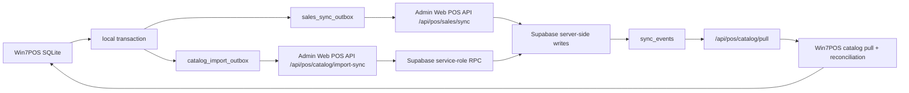

# POS / Admin Web / Supabase sync architecture

Status: code-aligned architecture note for branch `fix/win7pos-hardening-phase3`.
Last updated: 2026-07-06.

## Logical flow

Win7POS never calls Supabase directly. The POS persists local business changes first, enqueues sync work in SQLite, and sends HTTPS requests only to Admin Web. Admin Web owns Supabase service-role access and redacts audit metadata.

## SQLite tables

- `products`: local sale catalog cache, soft-delete fields, `remote_product_id`.
- `product_meta`: local supplier/category/stock metadata keyed by barcode.
- `product_price_history`: local price audit trail, `remote_price_id`, and catalog import client-item/idempotency markers for late ACK safety.
- `sales`, `sale_lines`, `local_stock_movements`: local sales and stock movement source records.
- `sales_sync_outbox`: sales/revenue/stock at-least-once queue.
- `catalog_import_outbox`: Supplier Excel import queue with `client_import_id`, `idempotency_key`, `payload_hash`, `attempt_count`, `server_import_id`, `server_request_id`.
- `app_settings`: trusted sync status, last catalog/sales sync timestamps and bootstrap state.
- `security_events`: local audit/security diagnostics.

## Supabase tables

- `inventory_products`, `inventory_categories`, `inventory_suppliers`: shop-scoped catalog records.
- `inventory_product_prices`: remote price history, source `pos_supplier_excel` for POS imports.
- `pos_catalog_import_batches`: server-side import ledger and idempotency guard.
- `sync_events`: catalog/prices change feed used by pull and admin diagnostics.
- `audit_logs`: redacted POS import success/failure records.
- `shops`, `shop_devices`, `pos_device_credentials`, `pos_sessions`, `staff_accounts`, `shop_inventory_sources`: trusted POS auth and shop/source mapping.

## State machines

`catalog_import_outbox`:

- `pending -> in_progress -> acked`
- `pending -> in_progress -> retry`
- `pending -> in_progress -> failed_blocked`
- `retry -> in_progress`
- expired `in_progress -> retry` by lease recovery
- `acked` is terminal
- `failed_blocked` is terminal until manual review

`sales_sync_outbox` mirrors the same unresolved concept for local sales: `pending`, `retry`, `in_progress`, `acked`, and blocked/failed states. Restore guards treat unresolved sales and catalog rows as restore blockers.

## Idempotency contract

- `clientImportId`: stable POS batch identity derived from schema version and preview fingerprint.
- `idempotencyKey`: stable duplicate key, currently `clientImportId:schemaVersion`.
- `payloadHash`: hash of persisted payload; send-time tokens are excluded.
- `attempt_count`: local attempt token. ACK/retry/block require the current attempt count.
- `serverImportId`: Admin Web batch id, echoed as the remote import id.
- `serverRequestId`: Admin Web request id from the HTTP envelope.

Admin Web accepts a new idempotency key once, treats same key/hash as duplicate/idempotent, and treats same key with different hash as conflict. Win7POS only ACKs if remote `batch.clientImportId` and `batch.idempotencyKey` match the local outbox item.

## Conflict policy

- Same `idempotencyKey` and same `payloadHash`: duplicate/idempotent success, no duplicate product/price/sync events.
- Same `idempotencyKey` and different `payloadHash`: conflict; local row becomes `failed_blocked`.
- Same barcode changed in Admin Web while POS was offline: Admin Web/Supabase remains authoritative; next catalog pull reconciles local cache.
- Remote tombstone vs local active product: pull applies local soft tombstone, never hard delete.
- Local import without `remote_product_id`: ACK maps remote ids when returned; catalog pull reconciles barcode to `remote_product_id` when ACK lacks ids.
- Price conflict: remote price history is keyed by product/type/effective time; POS stores returned `remote_price_id` against the original local import client item.

## Recovery and reconciliation

- `CatalogImportOutboxRepository` leases work by `attempt_count` and a 15-minute `in_progress` window.
- `CatalogImportReconciliationService` recovers expired `in_progress` rows to `retry`, reports `failed_blocked`, and applies barcode-to-remote-product reconciliation without deleting rows.
- `CatalogImportSyncService` rejects persisted payloads containing `deviceToken`, `sessionToken`, password/PIN/token markers.
- ACK remote ids update `products.remote_product_id` and `product_price_history.remote_price_id` in the same SQLite transaction as `acked`.
- `PosCatalogPullService` applies remote products/prices, queues unresolved prices, and replays pending prices after product ids are known.
- Restore/maintenance refuses restore while `sales_sync_outbox` or `catalog_import_outbox` contain unresolved work.

## Invariants

- POS has no direct Supabase client, Supabase URL, anon key, or service-role key.
- Admin Web service-role access is server-only.
- Persisted catalog import payload does not include `deviceToken`, `sessionToken`, password, PIN, or full workbook path.
- Supplier Excel apply and catalog outbox enqueue are one SQLite transaction.
- ACK/retry/block are attempt-token guarded.
- Remote ACK must match `clientImportId` and `idempotencyKey`.
- No hard delete for local products, outbox rows, sales, sale lines, or history.
- `failed_blocked` rows are not cleared by restore/maintenance/reconciliation.
- Status UX separates sales sync from catalog import sync, including retry and blocked counts.

## Verified by tests

- MSTest: catalog outbox idempotency, lease recovery, attempt mismatch, late retry protection, remote product/price id ACK, late price ACK client-item mapping.
- CLI: `--catalog-import-outbox-selftest`, `--catalog-import-sync-http-harness`, `--catalog-import-reconciliation-selftest`, `--sqlite-integrity-selftest`, `--db-restore-guard-selftest`.
- PowerShell gates: catalog import outbox/sync, start-of-day, sync status UX, restore guard, security hardening.
- Admin Web foundation: TASK-094 route boundary, transactional RPC migration, service-role-only ledger/RPC, ACK remote id fields.

## Live gates

Staging Supabase migration, positive staging E2E, Cloudflare deploy/CI artifact proof, and Windows 7 physical smoke require owner-authenticated infrastructure or physical runtime. Local code paths are prepared for those gates without embedding secrets.
