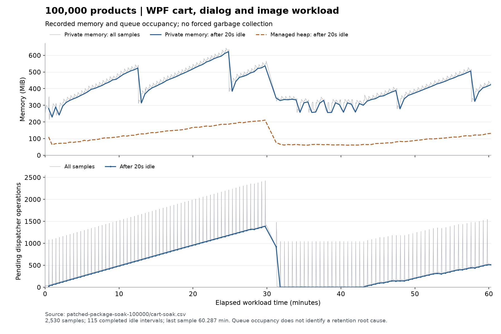

# Win7POS post-PR109 residual closeout

Task ASUS-W7POS-017 starts from `be370ba31b7cc5fa79d9fb04263fbdc336dcbb26`.
ASUS-W7POS-016 and F01–F12 remain delivered. This is a continuation, not a
repeat audit. Final SHA, workflow run IDs and artifact hashes are attested
outside this commit to avoid a self-referential SHA update.

## Scope and current findings

| Area | Classification at intake | Result |
| --- | --- | --- |
| A. Published application | PR109 already merged; initial local/origin main identical, 0/0 | F01–F12 preserved; reproduced late product-editor render crash corrected below |
| B. Article staging | Historical readiness superseded; zero logical runs | NOT_EXECUTED; new Admin readiness and supported fresh-run contract required |
| C. Image recovery | Existing encrypted checkpoint, cleanupPending=true | NOT_EXECUTED; preserved, no retry of denied authority |
| D. Performance | Short measurements do not establish retention | Measurement PASS: 60m17s / 115 cycles; stability qualification FAIL under recorded conditions (recurrent queue growth and UI latency outliers) |
| E. Installer | Release Pack exists, installation requires authorized QA host | Download/integrity work below; install/upgrade/uninstall NOT_EXECUTED |
| F. External qualification | Win7/peripherals and process-start permission absent | NOT_EXECUTED; one owner execution card below |

There were **56** worktrees at intake (55 other checkouts), all clean. Paths,
heads, branches and statuses are inventoried privately and must remain
unchanged outside the delivery checkout. This supersedes the previous count
of 54 other worktrees without deleting or incorporating any of them.

### P109-P01 — Release Pack omitted a checksummed file

Reproduction: download [Release Pack run 36181404999](https://github.com/XNIW/Win7POS/actions/runs/36181404999),
extract its payload ZIP into `Win7POS/` under the downloaded artifact root,
and invoke `scripts/win7pos/windows/test-protected-release-artifacts.ps1`.
The canonical verifier fails: `A checksummed release artifact is missing`.
The sole missing checksummed path is `Win7POS-build-report.md`.
The workflow generated and checksummed that report, but its upload path list
omitted it. The patch adds that existing file to the ReleasePack upload list.
No checksum, provenance or signature validation is weakened.

[PR110](https://github.com/XNIW/Win7POS/pull/110) merged normally as
`4b8af5dc8e8466da1cda53e1ffb3c96a7b994330` after checks on exact head
`f23b116378248c86af09db1697f4871104fd85be`. Merge checks passed:
[CI](https://github.com/XNIW/Win7POS/actions/runs/36190637655),
[Security/CodeQL](https://github.com/XNIW/Win7POS/actions/runs/36190637651),
[Release Pack](https://github.com/XNIW/Win7POS/actions/runs/36190637616).
The same downloaded-artifact verifier failed on the original run and passed
on [fixed-head run 36186872014](https://github.com/XNIW/Win7POS/actions/runs/36186872014):
62 checksummed release files, 41 raw payload files, matching dist/Setup copies.
The final readiness/evidence delivery and exact final merge receipt are in
[PR111](https://github.com/XNIW/Win7POS/pull/111), updated outside this commit.

The generalized verifier below downloads dist, Setup and ReleasePack via `gh`,
verifies the exact run SHA and each GitHub archive digest, compares dist with
the embedded ZIP and both Setup copies, then invokes the existing canonical
integrity verifier. It records Authenticode separately and never installs:

```powershell
pwsh -NoProfile -File scripts/win7pos/windows/test-downloaded-release-pack.ps1 -RunId <successful-run-id> -ExpectedCommitSha <40-character-sha> -OutputDirectory C:\QA\download-verification
```

This fills the post-download reproducibility gap exposed by P109-P01; it does
not replace any existing release validator. PowerShell 7.4+ is required only
on the build/QA host to preserve native ZIP byte output, not on Windows 7.

All 39 downloaded payload paths independently match the canonical normalized
manifest. `VERSION.txt` uses the validator's documented BuildTimestampUtc-only
normalization; comparing its raw hash to that normalized hash is invalid.
The downloaded GitHub archive, embedded payload ZIP, Setup EXE and prior local
candidate are distinct files and retain separate hashes in the attestation.

## Staging prerequisites and preserved state

Admin repository: [XNIW/merchandise-control-admin-web](https://github.com/XNIW/merchandise-control-admin-web).
Initial fetched Admin origin/main: `918e8e1cbe2d286c3a81b59ad586d7031fac9a78`;
read-only refresh on September 26: `db5bb83a8d54a99ae8637d3cc770af723cf00da3`.
The intervening WeChat changes are outside this task. The new Win7POS JSON
readiness is still absent and TASK-150 remains paused;
the existing local checkout is preserved. Its current handoff explicitly
withdraws the old readiness. TASK-148 is user-confirmed closed. TASK-150 is
paused and preserves its prior evidence; neither is reactivated here.

### P109-Q01 — Article runner bound to a closed historical execution

The previous wrapper checked literal runtime `9fb54f50`, deployment `5ad3652d`
and version `57af0535` in a superseded Markdown handoff. It could not accept
a genuinely new run. The replacement consumes a typed JSON readiness from
`docs/HANDOFFS/WIN7POS_ARTICLE_ACCEPTANCE_READY.json` in the **exact fetched
Admin main commit**, never an arbitrary local file. The file does not exist
in current Admin main and no READY document was issued in this task.

`-ReadinessRunId` selects the new ID previously reserved by the maintainer;
existing evidence directories are rejected so an execution identity cannot
be reused locally; the maintainer must reserve an unused identity remotely.
The namespace remains compatible with the current harness, but
timestamp/random identity must be fresh. Validation runs both before build
and before any data-directory move or harness launch. That final check also
refetches the exact current Admin revision and rejects a removed or changed
readiness document. The canonical gate
executes synthetic positive/negative contract tests without staging requests.
The final test set has one positive and 38 negative vectors. An additional
negative vector reproduced PowerShell accepting an array-valued `state`;
the parser now checks JSON string types before conversion, including contract
digests. The vector fails before the type check and passes afterward.

The same wrapper now requires `-ReleasePackRunId` for the final client SHA.
Inspection showed that the prior wrapper rebuilt exact source but did not bind
the resulting assemblies to the released package. It now reuses the canonical
download verifier, overlays all production payload files into its newly built
QA harness, records their hashes and verifies them before and after both
prepare/restart phases. No staging call is needed to test this binding. The
small `Win7PosQaPayload` helper and its synthetic file tests cover stale local
assemblies, changes after copy, duplicate/escaping manifest entries, missing
application files and overlapping source/destination. The QA credential guide
is updated solely to document the required readiness/release arguments.
The file-level runtime suite passes one positive and six negative cases; the
same helper also copies and verifies all 41 files of the real downloaded
`b79451f0a475` package. All 48 canonical gates pass after this runner change.

The Admin maintainer must review and publish a new handoff through its normal
reviewed Git procedure after authorized live checks. The consumer contract is:

| Fields | Required evidence and checks |
| --- | --- |
| `schemaVersion`, `state` | `win7pos-article-readiness-v1`, `READY`; unknown/missing/duplicate fields fail |
| `runId`, `clientCommitSha` | Exact reserved fresh ID and exact final client commit; prior IDs cannot be reused |
| `environment`, `stagingHost` | `staging`, exactly the validated vault profile host |
| `profileBindingSha256` | Full SHA256 of UTF-8 `win7pos-qa-scope-v1`, NUL, host, NUL, shop code, NUL, random device identity; generated inside vault validation, no credential included or exposed |
| `scope`, `scopeManifestSha256` | `qa-articles-zero-sales` and hash of the privately approved manifest; raw identities stay private |
| `adminRuntimeCommitSha`, `workerDeploymentId`, `workerVersionId` | Full source SHA and nonempty GUIDs from authorized actual deployment inspection, independently of Admin main |
| `issuedAtUtc`, `expiresAtUtc`, `deploymentVerifiedAtUtc` | Explicit UTC ISO strings; validity <=2h, deployment inspection within 15m before issuance; no expired or future readiness |
| `qaScopeClean`, `salesAllowed`, `activeQaRuns` | Typed true, false, zero; scoped preflight verified by maintainer |
| `http503`, `exceededCpu`, `exceededMemory` | Typed integer zeros from fresh server readiness probes |
| `contractDigests` | Exact SHA256 of the current request/response/firstLogin fixtures under `tests/fixtures/POS-ARTICLE-MUTATION-V1` |

The JSON is a maintainer attestation, not a credential or a substitute for
server authorization. The wrapper explicitly records that deployment identity
comes from this attestation, not an independent live probe. A current issuer
and authorized staging readiness remain external prerequisites; no Admin
runtime code, source task activation or deployment was changed.

Admin's initial master-plan receipt reports selective staging source
`c55f88a36ac89684f25fd503ca7a3bc085c08660` and Worker version
`6343d39c-d50a-4c88-89df-676f709697a2`, distinct from Admin main. An actual
read-only `wrangler deployments list --name merchandise-control-admin-web-staging
--json` was attempted with the existing local Wrangler. It returned missing
noninteractive Cloudflare authentication. Therefore these are **reported**
deployment values, not a freshly verified deployment. No temporary account,
alternative privileged credential or deployment was used.
The September 26 refresh reports a later Worker identifier
`f1e2e3ce-557b-42f4-9159-e796dc635c32` with the same selective source
`c55f88a3`; it describes an enrollment-only WeChat change. This is also a
maintainer-reported value, not a live deployment verification by this task.

The canonical local QA credential validator passes version 2, restricted ACL,
DPAPI decryption and staging host checks. That says nothing about remote actor
authorization. The image denial is `boundary_result_issue_failed_bootstrap_actor_denied`.
Current server code checks runtime lease, shop/device/session/staff identity,
credential versions, both secret hashes and `catalog.write`; the error does
not isolate which check failed. Expiry alone is not proven.

The existing 1,926-byte DPAPI checkpoint remains in its required QA directory.
Its hash and directory inventory are saved privately; neither checkpoint,
database, credentials, scope identifiers nor manifest is published.
The last diagnostic has cleanupPending=true, zero completed controls and no
new matrix. Remote scope/ownership/count verification requires the denied
canonical boundary; it has not been replaced by direct SQL or other endpoints.

## Performance protocol and reproducibility

Run Release net48/x86 on Asus Windows 11 with SDK 10.0.301. Build and tests are
serialized. Use new output directories outside the repository:

```powershell
pwsh -NoProfile -File scripts/run-cart-performance.ps1 -OutputDirectory C:\QA\post109-20k -Products 20000
pwsh -NoProfile -File scripts/run-cart-performance.ps1 -OutputDirectory C:\QA\post109-100k -Products 100000 -SoakMinutes 60
```

`-HarnessDirectory` can select a harness overlaid with exact downloaded
package assemblies. The runner records and rechecks every EXE/DLL hash,
rejects reused evidence directories, bounds process duration, and checks
sample counts and soak duration. It runs the existing QA harness, not the
previously denied production process-start benchmark.

Preserved baseline: 20k/100k products, ten price-history rows per product,
carts 1/10/50/100/500. Sample 0 is the first invocation; warm samples 1–30
are summarized separately with nearest-rank p50/p95 and maximum. Cases
run in the same process in that order: "first"
means first for that case, not a fresh process/JIT/OS cache state. All samples,
including outliers and incomplete probes, are retained. The stage CSV adds
service, snapshot application, layout, bitmap allocation and bitmap rendering.
These are successive measured work stages in one process, not an OS-cold
launch or physical monitor paint measurement; JIT/GC remain included.

The soak repeats a 500-line cart, ten scans in rows and grid modes, discount
dialog open/close, real product-image presenters/editor with synthetic image
states, and a 20-second idle interval. It records private/managed bytes,
handles, GDI/USER objects, threads, cumulative GC counts, Send-priority
dispatcher probe, observed pending dispatcher operations, image metadata
cache/lookups and scan/render timings. No forced GC is used. Image presenter
coverage is local UI lifetime coverage, not remote transfer/cache acceptance.

A preliminary probe with a Background-priority dispatcher observation stalled
on the occluded desktop and was terminated with its partial evidence preserved.
The corrected probe uses the same Send priority as the existing scan benchmark;
it completed three cycles in 88 seconds. This probe is not the qualification run.
An initial long run was also stopped after the observer's strong references
were found capable of retaining dispatcher operations. Its samples are kept
as invalid qualification evidence. The final observer uses weak references,
prunes completed/aborted operations and counts distinct live operations, so
the instrumentation cannot retain their closures. A subsequent weak-reference
probe was stopped after about five minutes to add callback diagnostics; its
apparent pending-count growth is not proof of an application leak. Both
diagnostic one-minute probes completed and identified the idle queue as the
measurement callback and transient WPF input/hit-test callbacks. Desktop and
instrumentation conditions differed across these probes; no sole cause is
claimed for their different queue behavior.

The host is an ASUS Zenbook 14 UX3405CA, Intel Core Ultra 7 255H, 16 logical
processors, 16,497,893,376 bytes RAM, Windows 11 Home Single Language
10.0.26200. Both installed Framework registry views report version
`4.8.09221`, release value `533509`; `net48` is the build target, not a claim
that this Win11 runtime qualifies the Windows 7 installation.
Read-only `powercfg` queries reported zero AC/DC values for both display-idle
and standby-idle timers during the repeat; no power setting was changed.
Physical foreground/unlocked display state was not independently confirmed.
Local build/test work is serialized around soak execution.
JIT is included in first-use timings; the local CLR JIT
performance-counter set was unavailable, so JIT duration is not isolated.
Offscreen bitmap timing does not establish physical display paint latency.

The first long measurement used all downloaded PR109 production payload files
(`be370ba3`) overlaid into the diagnostic harness. The harness source is
committed in `e3b67ce7a0d0ec7181d47872c5b05de8206e6ad2`; its SHA256 is
`1f36401a81df43b8d915bc456880d9d35bd2b1896caa912d4bc1be6db543b026`.
Every EXE/DLL hash is recorded in the public protocol and was rechecked after
termination. This attempt is **NOT COMPLETED**, not PASS: it recorded 108
complete cycles and a partial cycle, last elapsed 3507.805 seconds, before
Modern Standby. Windows Kernel-Power event 506 records `Reason: Lid` at
2026-09-25 18:55:15 local, just after the final sample. On resume the wrapper
correctly enforced its wall-clock deadline and terminated its own harness.
The missing terminal PASS and missing full 60-minute duration are preserved.
These samples predate the product-editor lifetime fix below. They are not
evidence that the patched application completed a soak. Final-package
measurements and hash receipts remain separate: a different versioned binary
is never labeled byte-identical.

A later patched-package attempt was also interrupted, independently of the
application fix: its last sample is 3299.835 seconds (107 complete cycles and
a partial cycle, 2,375 samples). Windows records the Codex sandbox service
being asked to stop at 13:16:18 local on September 26 and restarting at
13:16:19, during the final idle interval. The wrapper and harness were absent
afterward, with no terminal PASS or harness error file. No application-error
or suspension event was observed in that interval. All 41 package files still
matched their hashes. This is **NOT COMPLETED**, not a 60-minute PASS; its raw
data and the service events are preserved under `interrupted-patched-soak-100000`.

Safe raw CSVs, binary hash protocols, completed and stopped probes are in
[the evidence directory](evidence/2026-09-25-post-pr109/README.md).
No database, credential, encrypted checkpoint or private manifest is included.

### Completed benchmark samples before the interrupted soak

Milliseconds; each row has one first invocation and **30 warm samples**.
All 1/10/50/100/500-line scan cases and other flows are retained in CSV.

| Dataset / operation | First | Warm p50 | Warm p95 | Warm maximum |
| --- | ---: | ---: | ---: | ---: |
| 20k, 500-line service scan | 5.947 | 6.265 | 7.521 | 9.500 |
| 100k, 500-line service scan | 13.272 | 6.369 | 11.401 | 11.563 |
| 20k, scan + view bitmap | 1825.087 | 173.219 | 243.695 | 1831.738 |
| 100k, scan + view bitmap | 2366.519 | 204.502 | 324.387 | 2335.408 |
| 20k, layout stage | 9.776 | 3.268 | 24.713 | 1625.827 |
| 100k, layout stage | 22.177 | 3.673 | 7.620 | 2085.842 |
| 20k, bitmap render stage | 87.049 | 116.827 | 125.916 | 129.683 |
| 100k, bitmap render stage | 97.942 | 129.705 | 191.841 | 192.058 |

First view entry in the already-running process is 324.230 ms (20k) and
599.516 ms (100k), one observation each. The first scan-with-view service
stage is 1710.964/2234.564 ms; the large second-sample outlier instead lies
in layout (1625.827/2085.842 ms). These measurements identify where elapsed
time occurred; they do not attribute the cause to JIT alone. They also do
not establish a speedup: these two baseline datasets use identical application source and desktop,
runtime and GC scheduling vary. No application patch is justified from
these timings alone. Process launch/close remains NOT_EXECUTED by policy.

### P109-U01 — Product editor late render after close

The September 26 repeat overlaid with all 41 downloaded files from merge
`4b8af5dc8e8466da1cda53e1ffb3c96a7b994330` failed after three full cycles
and a partial fourth (last sample 100.488 seconds). The harness exited 2 with
`ObjectDisposedException` in `ProductEditDialog.OnContentRendered`: a WPF
callback arrived after `OnClosed` had disposed `_imageLifetime`.

This is an application defect reproduced by the soak, separate from the
earlier host suspension and staging preflight failures. The patch records
closure before cancellation/disposal, ignores content-rendered work after
closure (including closure by a ContentRendered subscriber), and ignores
queued focus work for a closed dialog. Sizing, positioning, shared resources,
owner rules and image cancellation remain unchanged.

The runtime regression `P109_product_editor_late_render_close` uses a real
ProductEditDialog, closes it and delivers its virtual render callback in
both event orderings. It fails before the patch with the same disposed-source
exception and passes afterward. It is the eighth isolated functional scenario
in the canonical CI smoke. Dialog standards pass 35/35 and x86 builds have
zero warnings/errors. The failed repeat's numeric samples and exception are
preserved publicly; its misleading historical directory prefix `completed-`
is explicitly not a PASS. The later full patched-runtime soak is reported below.

The patched local-build diagnostic probe completed 322.783 seconds and 11
cycles without the crash. It is an execution PASS, not a memory-stability
PASS: pending operations increased from 26 to 235, including 150 WPF
InitTextStore callbacks at the last idle sample; managed memory was 66.363 MiB
at the second idle sample and 88.993 MiB at the last. Image lookups stayed zero
and the cart metadata cache stayed at 500. The optional WPF native-pending
diagnostic was true after each idle interval. The flag alone does not prove
starvation: the subsequent package run also reports true with only three
pending operations. Neither observation proves an application cache leak
or identifies the native event. WPF's [dispatcher scheduling source](https://github.com/dotnet/wpf/blob/main/src/Microsoft.DotNet.Wpf/src/WindowsBase/System/Windows/Threading/Dispatcher.cs)
is a behavioral reference, not proof of this net48 host's root cause;
[MsgWaitForMultipleObjectsEx](https://learn.microsoft.com/en-us/windows/win32/api/winuser/nf-winuser-msgwaitformultipleobjectsex)
can also signal for internal system events such as activation. No callbacks
are forcibly drained, reprioritized or discarded, and no GC is forced.

### Patched package benchmark

These completed samples use the downloaded `b79451f0a475` package described
below. Milliseconds; one first invocation plus **30 warm samples** per row.
They are separate from the older, pre-fix measurements above.

| Dataset / operation | First | Warm p50 | Warm p95 | Warm maximum |
| --- | ---: | ---: | ---: | ---: |
| 20k, 500-line service scan | 6.483 | 5.954 | 7.266 | 9.531 |
| 100k, 500-line service scan | 5.753 | 5.647 | 8.214 | 8.469 |
| 20k, scan + view bitmap | 1888.782 | 173.067 | 227.816 | 1690.701 |
| 100k, scan + view bitmap | 1747.319 | 157.783 | 204.896 | 1631.069 |
| 20k, layout stage | 9.575 | 3.120 | 4.701 | 1494.659 |
| 100k, layout stage | 9.173 | 2.817 | 5.282 | 1436.852 |
| 20k, bitmap render stage | 94.864 | 110.529 | 154.724 | 164.233 |
| 100k, bitmap render stage | 86.959 | 99.846 | 113.725 | 149.227 |

First view entry is 352.755/380.834 ms for 20k/100k (n=1 each), inside an
already-running harness. The first scan-with-view service stages take
1770.910/1641.337 ms; the second sample includes 1494.659/1436.852 ms of
layout work. These outliers remain included. JIT, GC and desktop effects
are not isolated enough to infer a production speedup or physical paint SLA.

### Completed patched-package soak and remaining performance limitation

**Execution PASS; stability qualification FAIL in the recorded environment.**
The final repeat completed on September 26, 16:21–17:22 UTC, with the terminal
runner PASS: **115 complete cycles, 2,530 samples, 3,617.240 seconds** of
workload. All 41 downloaded production payload files matched before and after.
No Kernel-Power 42/506 suspension event occurred during this run. This is the
completed dataset `patched-package-soak-100000` in the public evidence; the
earlier interrupted patched attempt has a separate directory and status.

| Metric | Samples | p50 | p95 | Maximum |
| --- | ---: | ---: | ---: | ---: |
| Rows scan + snapshot apply, ms | 1,150 | 68.905 | 1,735.806 | 2,785.086 |
| Rows layout + bitmap, ms | 1,150 | 148.894 | 313.169 | 2,621.655 |
| Grid scan + snapshot apply, ms | 1,150 | 70.169 | 182.335 | 429.782 |
| Grid layout + bitmap, ms | 1,150 | 142.674 | 268.921 | 639.471 |
| Send dispatcher probe, ms | 2,530 | 0.264 | 0.490 | 17.045 |
| Subsequent complete cycle, seconds (includes 20s idle) | 114 | 29.901 | 33.977 | 89.838 |

The first complete cycle took 28.575 seconds. Soak scan timing includes the
asynchronous service wait and snapshot application on the UI thread; it is
not interchangeable with the isolated service-scan benchmark. Rows outliers
recur after switching mode: 111 of 112 scan samples exceeding 500 ms are the
second or third scan of their ten-scan batch. The third scan has p50 1,650.547
ms (115 samples). This is not explained by excluding the first invocation.
The existing stage data locates elapsed work but does not isolate scheduling,
GC and control realization sufficiently to justify changing production list
virtualization or dispatcher priorities. No arbitrary latency SLA is invented.

| Equivalent after-idle metric | First 10 mean | Last 10 mean | All-sample maximum |
| --- | ---: | ---: | ---: |
| Private memory, MiB | 302.742 | 437.064 | 642.469 |
| Managed heap, MiB | 77.768 | 119.298 | 368.733 |
| Pending observed dispatcher operations | 133.3 | 443.8 | 2,425 |
| Process handles | 697.9 | 708.4 | 750 |
| GDI objects | 27.2 | 27.8 | 46 |
| USER objects | 43.0 | 43.4 | 50 |
| Threads | 36.1 | 35.3 | 44 |

Private memory decreased in all 115 before/after-idle pairs, by 22.202 MiB
on average. Nevertheless, successive idle levels grew for roughly 30 minutes.
The queue subsequently returned naturally to 1–3 pending operations and the
idle heap to roughly 61–65 MiB, before another growth interval; the final idle
sample has 512 pending operations and 131.296 MiB managed heap. This recovery
contradicts a claim of monotonic permanent retention, but does not establish
stable idle occupancy. The metadata cache stayed at 500 entries and image
lookups at zero. GC counters remain in the CSV; no collection was forced.



FAIL means this run does not support memory/queue stability or consistent UI
latency qualification. It does not identify an application leak or prove
failure on a foreground production desktop. The one operator card specifies
the remaining controlled-desktop reproduction and causal evidence needed.
The corrected late-editor callback did not recur during the completed soak.
The public CSVs, summary generator and pinned chart dependencies make these
results independently reproducible without a private Asus script.

## Validation and package binding

After the editor lifetime fix, the serialized local suite passed locked
restore, 48 canonical gates, solution/WPF/harness builds, **1,033/1,033
Core/Data tests with zero skipped**, CLI self-test, image profile/net48
serialization, eight isolated functional scenarios and 50 visual captures,
authorization, bounded logging (100k) and product paging (100k). The optional
native-pending diagnostic was included in the subsequent harness build and
smokes; all 48 gates passed again after that instrumentation change.

On exact application-fix head `b79451f0a475764083e1cccff3267b0b2864fa58`,
[CI 36250295056](https://github.com/XNIW/Win7POS/actions/runs/36250295056),
[Security/CodeQL 36250295177](https://github.com/XNIW/Win7POS/actions/runs/36250295177)
and [Release Pack 36250291927](https://github.com/XNIW/Win7POS/actions/runs/36250291927)
passed. That exact downloaded package supplied all 41 production payload files
for the patched 20k/100k measurements and the late-render runtime regression.
The harness source hash is
`fcdcaa50989195f10403e1c22a40b6b19a4b8a4f1981c63ea9d85c543b21033f`.
Its Git blob is `9d2c9fbcf9d747b79d2ea3e61228f11c1fcfe139`; the public
`harness-source-binding.json` also records the LF-normalized hash so checkout
line-ending conversion is not mistaken for a source change.
These identifiers bind the long-run evidence; they are not substituted for the
final merge's workflow and package receipts in PR111/the external attestation.
The final package is rebuilt and versioned for its own SHA. Reuse of this long
run requires unchanged application/build-dependency source, unchanged measured
harness source and byte-identical vendor runtime dependencies; the final
package still receives its own integrity checks and runtime smokes. This does
not claim that differently versioned Win7POS assemblies are byte-identical or
that another 60-minute run was executed on the final merge.

The downloaded patched release passes all 62 checksummed-file validations.
Separate Authenticode checks return 14 valid vendor signatures and 19 unsigned
files among the 33 distributed EXE/DLLs including Setup. Win7POS.Core,
Win7POS.Data, Win7POS.Wpf and Setup are unsigned. This is a development-unsigned
candidate, not a production-signed release. No certificate was created.
Final artifact digests, inner payload ZIP hash, Setup hash and local candidate
hash are recorded as separate objects after the final merge download.

## Installer and operator execution card

The Inno script requires administrator rights, .NET Framework 4.8 and VC++ x86,
targets Windows 7 SP1+, writes Program Files/shortcuts/uninstall registration,
and intentionally preserves ProgramData. A separate data folder does not
isolate installation effects. No authorized VM/snapshot or QA installation
target has been provided, so no install/uninstall is attempted on Asus.

Execute the following only with the named owner/environment authority, then
attach one redacted receipt per row to this task's final attestation:

| Owner / environment | Required action and evidence |
| --- | --- |
| Admin maintainer, staging | Confirm the actual deployed source SHA, deployment/version and supported POS contracts through authenticated Cloudflare read access. Issue a new readiness for the final client SHA, new run ID, isolated shop/scope manifest, clean preflight and expiry; do not edit the superseded marker. Review/test any new producer and consumer contract in their repositories. |
| Shop/QA authority + Admin maintainer, staging | Explicitly authorize rehabilitation of the original image bootstrap actor through the administrative procedure. Verify lease, identity, credential generation, catalog.write and environment. Then run the existing `Invoke-Win7PosProductImageStagingAcceptance.ps1` against its preserved directory: first recovery/cleanup, verify terminal receipt/counts/ownership/idempotence, then a distinct new matrix. No synthetic sales in article/image scope. |
| QA desktop operator, Asus/Win11 | Record an unlocked, foreground, awake desktop and repeat the retained 60-minute protocol without concurrent builds/tests. Check equivalent idle heap/queue recovery and callback classes; if the backlog recurs, collect causal dispatcher/retention evidence before changing application behavior. The current native-pending flag alone does not identify the cause. |
| QA VM/snapshot operator | Preserve the old candidate and snapshot; verify final artifact hashes/signatures, install clean, launch, save synthetic settings/DB, install upgrade from previous candidate, verify persistence, uninstall and verify retained data. Record registry/shortcut behavior, logs, installed hashes and rollback. |
| Win7 SP1 operator | On QA data verify net48/x86/SQLite, HTTPS/login, offline/online and restart, real scanner/focus/quantity/discount, one synthetic sale, return/void/reprint without duplicate stock or sale, interrupted backup/restore, DPI and monitor reachability. Record OS/hardware/driver and final hashes. |
| Printer/drawer owner | Give explicit operational consent; verify driver/spooler and Notepad first, then one bounded TEST receipt and error behavior. No automatic drawer pulse. |
| Environment policy owner | Explicitly approve the previously rejected production launch/close benchmark before it is run. Until then process-start cold/warm remains NOT_EXECUTED; a warm start is never labeled OS-cold. |

No new owner-accepted deferral or production qualification is inferred.
GitHub delivery and staging/hardware acceptance are separate outcomes.
